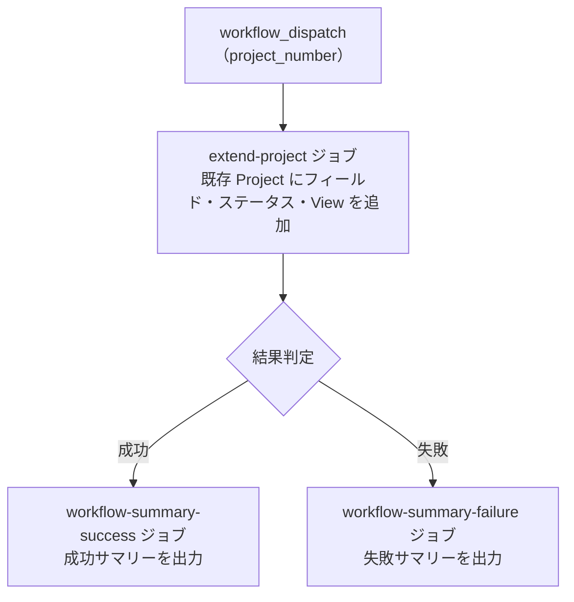

# ② GitHub Project 拡張

<!-- START doctoc -->
<!-- END doctoc -->

既存の `Project` にカスタムフィールド・ステータスカラム・`View` を追加します。
[① GitHub Project 新規作成](01-create-project) を実行していない既存 `Project` 向けです。

## 前提

このワークフローを実行する前に、クイックスタートを完了してください。

- [クイックスタート（GUI）](../quickstart-gui)
- [クイックスタート（CLI）](../quickstart-cli)

## 使い方

1. `Actions` タブを開く
2. `② GitHub Project 拡張` を選択
3. `Run workflow` をクリック
4. パラメータを入力して実行

## パラメータ

| パラメータ | 説明 | 必須 | タイプ | 例 |
|------------|------|:----:|--------|-----|
| `project_number` | 対象 `Project` の Number | ✅ | `number` | `1` |

## 処理フロー

