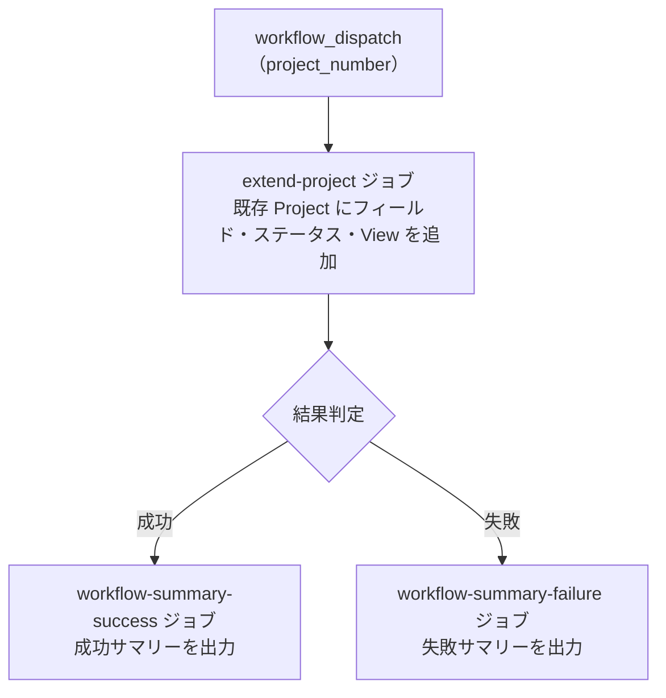

# ② 🔧 GitHub Project 拡張

<!-- START doctoc generated TOC please keep comment here to allow auto update -->
<!-- DON'T EDIT THIS SECTION, INSTEAD RE-RUN doctoc TO UPDATE -->
**Table of Contents**

- [✅ 前提](#-%E5%89%8D%E6%8F%90)
- [📖 使い方](#-%E4%BD%BF%E3%81%84%E6%96%B9)
- [⚙️ パラメータ](#-%E3%83%91%E3%83%A9%E3%83%A1%E3%83%BC%E3%82%BF)
- [📊 処理フロー](#-%E5%87%A6%E7%90%86%E3%83%95%E3%83%AD%E3%83%BC)

<!-- END doctoc generated TOC please keep comment here to allow auto update -->

既存の `Project` にカスタムフィールド・ステータスカラム・`View` を追加します。
[① GitHub Project 新規作成](01-create-project) を実行していない既存 `Project` 向けです。

## ✅ 前提

このワークフローを実行する前に、クイックスタートを完了してください。

- [クイックスタート（GUI）](../quickstart-gui)
- [クイックスタート（CLI）](../quickstart-cli)

## 📖 使い方

1. `Actions` タブを開く
2. `② GitHub Project 拡張` を選択
3. `Run workflow` をクリック
4. パラメータを入力して実行

## ⚙️ パラメータ

| パラメータ | 説明 | 必須 | タイプ | 例 |
|------------|------|:----:|--------|-----|
| `project_number` | 対象 `Project` の Number | ✅ | `number` | `1` |

## 📊 処理フロー

