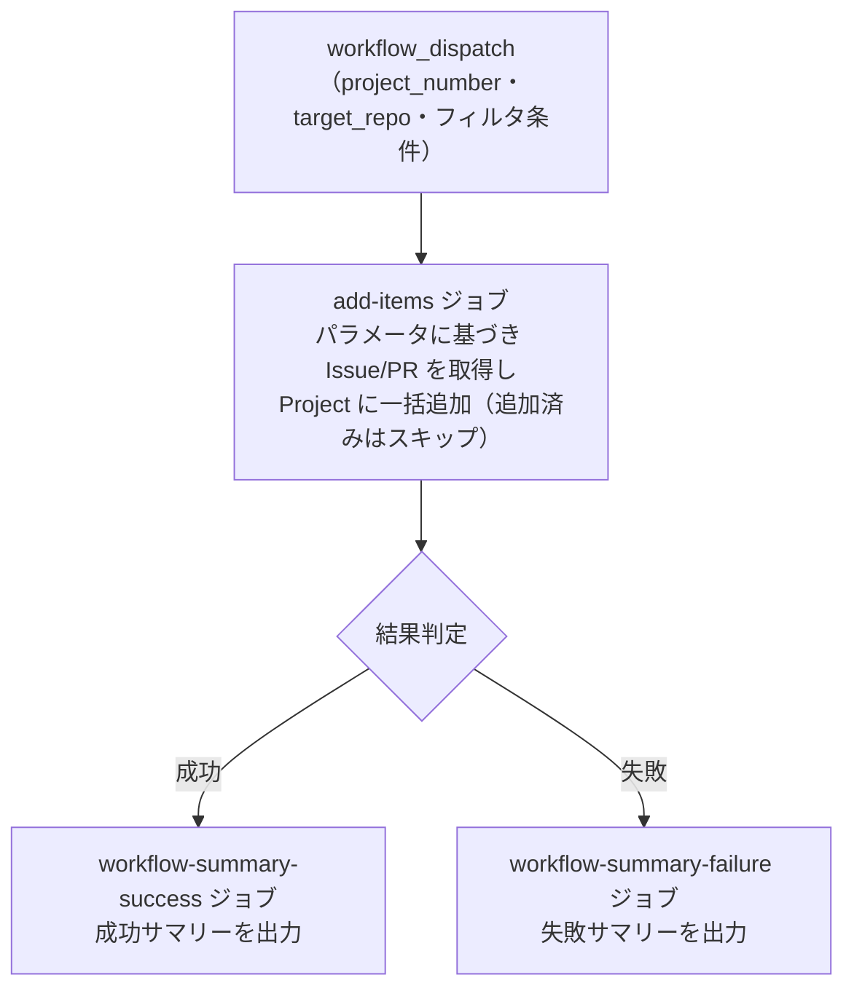

# ③ Issue/PR 一括紐付け

リポジトリの `Issue`/`PR` を `Project` に一括追加します。

## 使い方

1. `Actions` タブを開く
2. `③ Issue/PR 一括紐付け` を選択
3. `Run workflow` をクリック
4. パラメータを入力して実行

## パラメータ

| パラメータ | 説明 | 必須 | タイプ | 例 |
|------------|------|:----:|--------|-----|
| `project_number` | 対象 `Project` の Number | ✅ | `number` | `1` |
| `target_repo` | 対象リポジトリ（owner/repo 形式） | ✅ | `string` | `myorg/myrepo` |
| `item_type` | 対象アイテムの種別 | ✅ | `choice` | `all`（デフォルト） |
| `item_state` | 取得するアイテムの状態 | ✅ | `choice` | `open`（デフォルト） |
| `item_label` | 絞り込みラベル（指定ラベルのみ追加） | - | `string` | `bug` |

### アイテム種別

| 選択肢 | 説明 |
|--------|------|
| `all` | `Issue` と `Pull Request` の両方 |
| `issues` | `Issue` のみ |
| `prs` | `Pull Request` のみ |

### アイテム状態

| 選択肢 | 説明 |
|--------|------|
| `open` | オープン状態のもの |
| `closed` | クローズ状態のもの（CLOSED + MERGED を含む） |
| `all` | すべての状態 |

> **Note:** 既に `Project` に追加済みのアイテムは自動的にスキップされます。

## 処理フロー

