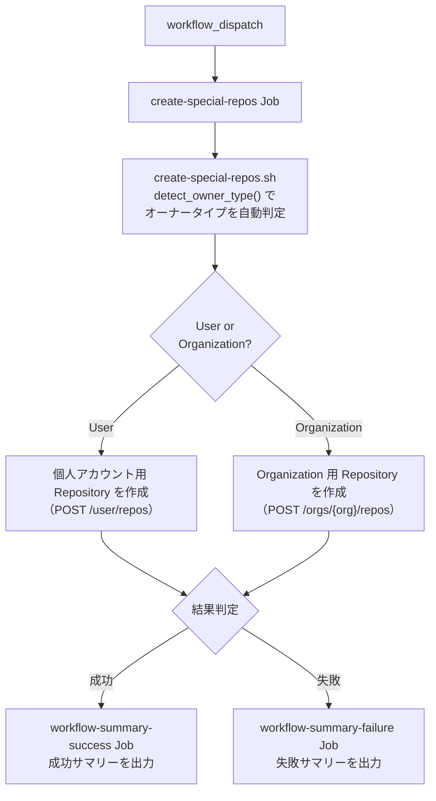

# ③ 特殊 Repository 一括作成

GitHub の特殊命名規則 Repository（プロフィール README、`GitHub Pages`、dotfiles 等）を一括作成します。
オーナータイプ（個人アカウント / Organization）を自動判定し、対応するスクリプトを実行します。

<!-- START doctoc generated TOC please keep comment here to allow auto update -->
<!-- DON'T EDIT THIS SECTION, INSTEAD RE-RUN doctoc TO UPDATE -->

<details><summary>（ここをクリック）目次</summary><ul>
<li><a href="#-%E5%89%8D%E6%8F%90">✅ 前提</a></li>

<li><a href="#-%E4%BD%BF%E3%81%84%E6%96%B9">📖 使い方</a></li>

<li><a href="#-%E5%AF%BE%E8%B1%A1-repository">📋 対象 Repository</a></li>

<li><a href="#-%E5%87%A6%E7%90%86%E3%83%95%E3%83%AD%E3%83%BC">📊 処理フロー</a></li>

<li><a href="#-workflow-%E4%BB%95%E6%A7%98">🔧 Workflow 仕様</a></li>

<li><a href="#-%E9%96%A2%E9%80%A3%E3%82%B9%E3%82%AF%E3%83%AA%E3%83%97%E3%83%88">📜 関連スクリプト</a></li>
</ul></details>

<!-- END doctoc generated TOC please keep comment here to allow auto update -->

## ✅ 前提

この Workflow を実行する前に、クイックスタートを完了してください。

- [クイックスタート（GUI）](../getting-started/quickstart-gui.md)
- [クイックスタート（CLI）](../getting-started/quickstart-cli.md)

## 📖 使い方

1. `Actions` タブを開く
2. `③ 特殊 Repository 一括作成` を選択
3. `Run workflow` をクリックして実行

> **Note:** 既存 Repository と同名の Repository が存在する場合はスキップされます。追加のみの安全設計です。

## 📋 対象 Repository

### 個人アカウント用

| Repository 名 | 挙動 |
|---|---|
| `<username>` | README.md がプロフィールページに表示される |
| `<username>.github.io` | `GitHub Pages` として自動公開される |
| `dotfiles` | `Codespaces` 起動時に dotfiles を自動インストール |

### Organization 用

| Repository名 | 挙動 |
|---|---|
| `.github` | パブリックプロフィール・Community Health Files が Organization 全体に適用される |
| `.github-private` | メンバーのみに表示されるプライベートプロフィール |
| `<orgname>.github.io` | `GitHub Pages` として自動公開される |

## 📊 処理フロー



## 🔧 Workflow 仕様

### ファイル

`.github/workflows/03-create-special-repos.yml`

### トリガー

`workflow_dispatch`（手動実行）

### 環境変数

| 環境変数 | ソース | 説明 |
|----------|--------|------|
| `GH_TOKEN` | `secrets.PROJECT_PAT` | GitHub PAT（`repo` Scope または `Administration: write`） |
| `PROJECT_OWNER` | `github.repository_owner` | Repository オーナー（自動取得） |
| `PROJECT_PAT` | `secrets.PROJECT_PAT` | PAT 形式検証用（`ghp_` または `github_pat_` で始まるか検証） |

> **Note:** `PROJECT_PAT` が未設定または無効な形式の場合、PAT を使用するステップはスキップされます。

### Job 構成

```
.github/workflows/03-create-special-repos.yml
  ├── create-special-repos Job
  │   └── scripts/create-special-repos.sh         # オーナータイプ自動判定 → 一括作成
  ├── workflow-summary-failure Job（失敗時）
  │   └── .github/actions/workflow-summary        # 失敗サマリー出力
  └── workflow-summary-success Job（成功時）
      └── .github/actions/workflow-summary        # 成功サマリー出力
```

## 📜 関連スクリプト

- [create-special-repos.sh](../scripts/create-special-repos.md) — 特殊 Repository 一括作成スクリプト
