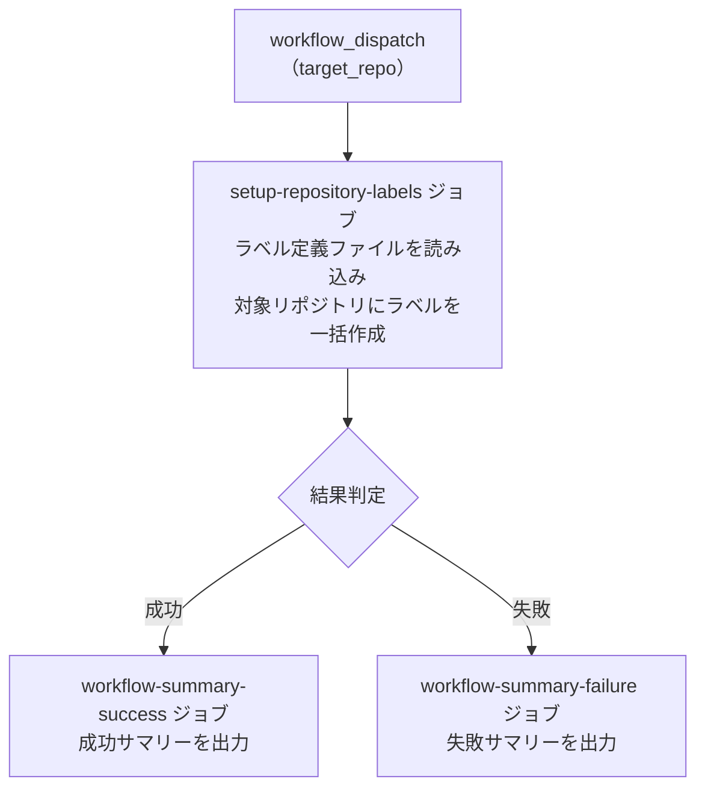

# ③ 🏷️ Issue ラベル一括追加

<!-- START doctoc -->
<!-- END doctoc -->

指定リポジトリに対して、設定ファイルで定義した Issue ラベルを一括作成します。
既存ラベルと同名のラベルが存在する場合はスキップします。

## ✅ 前提

このワークフローを実行する前に、クイックスタートを完了してください。

- [クイックスタート（GUI）](../quickstart-gui)
- [クイックスタート（CLI）](../quickstart-cli)

## 📖 使い方

1. `Actions` タブを開く
2. `③ Issue ラベル一括追加` を選択
3. `Run workflow` をクリック
4. パラメータを入力して実行

## ⚙️ パラメータ

| パラメータ | 説明 | 必須 | タイプ | 例 |
|------------|------|:----:|--------|-----|
| `target_repo` | 対象リポジトリ（owner/repo 形式） | ✅ | `string` | `myorg/myrepo` |

> **Note:** 既存ラベルと同名のラベルが存在する場合はスキップされます。定義ファイルに含まれない既存ラベルは削除されません。追加のみの安全設計です。

## 📊 処理フロー



## 🔧 ワークフロー仕様

### ファイル

`.github/workflows/03-setup-repository-labels.yml`

### トリガー

`workflow_dispatch`（手動実行）

### 権限

```yaml
permissions:
  contents: read
```

### 環境変数

| 環境変数 | ソース | 説明 |
|----------|--------|------|
| `GH_TOKEN` | `secrets.PROJECT_PAT` | GitHub PAT（`repo` または `public_repo` スコープ） |
| `TARGET_REPO` | `inputs.target_repo` | 対象リポジトリ |

### ジョブ構成

```
.github/workflows/03-setup-repository-labels.yml
  ├── setup-repository-labels ジョブ
  │   └── scripts/setup-repository-labels.sh    # ラベル一括作成
  ├── workflow-summary-failure ジョブ（失敗時）
  │   └── .github/actions/workflow-summary       # 失敗サマリー出力
  └── workflow-summary-success ジョブ（成功時）
      └── .github/actions/workflow-summary       # 成功サマリー出力
```

## 📜 関連スクリプト

- [setup-repository-labels.sh](../scripts/setup-repository-labels) — ラベル一括作成スクリプト
