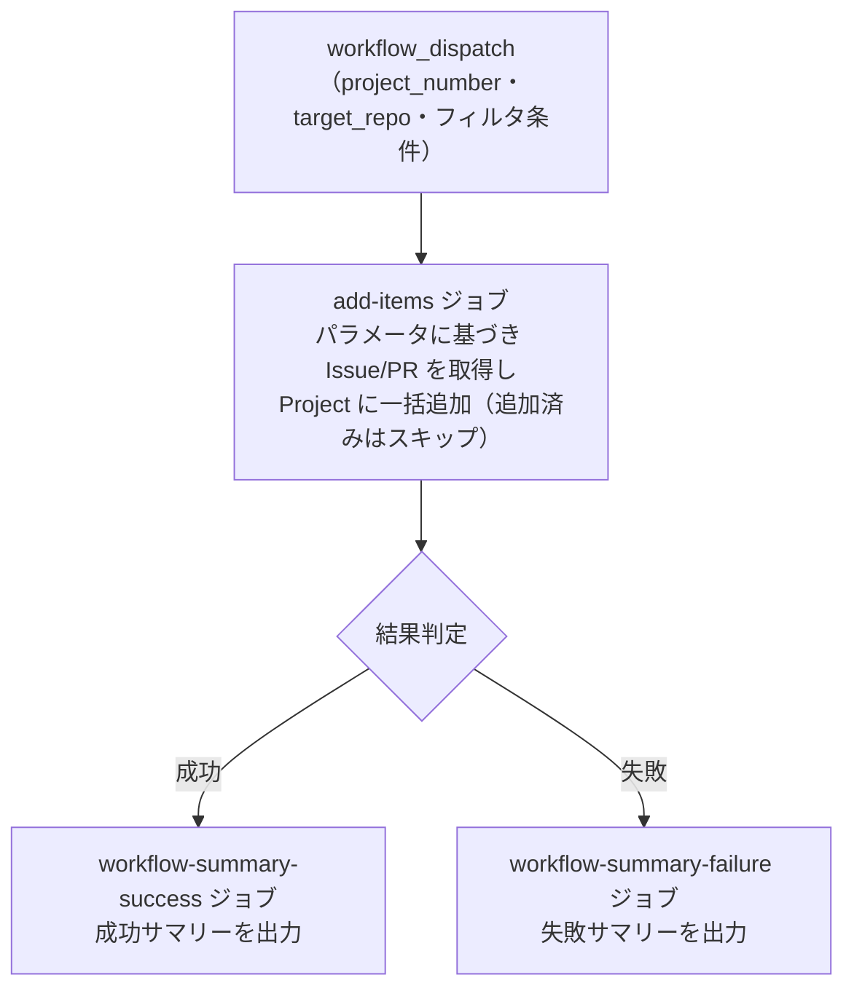

# ④ 🔗 Issue/PR 一括紐付け

<!-- START doctoc generated TOC please keep comment here to allow auto update -->
<!-- DON'T EDIT THIS SECTION, INSTEAD RE-RUN doctoc TO UPDATE -->
**Table of Contents**

- [✅ 前提](#-%E5%89%8D%E6%8F%90)
- [📖 使い方](#-%E4%BD%BF%E3%81%84%E6%96%B9)
- [⚙️ パラメータ](#-%E3%83%91%E3%83%A9%E3%83%A1%E3%83%BC%E3%82%BF)
  - [アイテム種別](#%E3%82%A2%E3%82%A4%E3%83%86%E3%83%A0%E7%A8%AE%E5%88%A5)
  - [アイテム状態](#%E3%82%A2%E3%82%A4%E3%83%86%E3%83%A0%E7%8A%B6%E6%85%8B)
- [📊 処理フロー](#-%E5%87%A6%E7%90%86%E3%83%95%E3%83%AD%E3%83%BC)

<!-- END doctoc generated TOC please keep comment here to allow auto update -->

リポジトリの `Issue`/`PR` を `Project` に一括追加します。

## ✅ 前提

このワークフローを実行する前に、クイックスタートを完了してください。

- [クイックスタート（GUI）](../quickstart-gui)
- [クイックスタート（CLI）](../quickstart-cli)

## 📖 使い方

1. `Actions` タブを開く
2. `④ Issue/PR 一括紐付け` を選択
3. `Run workflow` をクリック
4. パラメータを入力して実行

## ⚙️ パラメータ

| パラメータ | 説明 | 必須 | タイプ | 例 |
|------------|------|:----:|--------|-----|
| `project_number` | 対象 `Project` の Number | ✅ | `number` | `1` |
| `target_repo` | 対象リポジトリ（owner/repo 形式） | ✅ | `string` | `myorg/myrepo` |
| `item_type` | 対象アイテムの種別 | ✅ | `choice` | `all`（デフォルト） |
| `item_state` | 取得するアイテムの状態 | ✅ | `choice` | `open`（デフォルト） |
| `item_label` | 絞り込みラベル（指定ラベルのみ追加） | - | `string` | `bug` |

### アイテム種別

| 選択肢 | 説明 |
|--------|------|
| `all` | `Issue` と `Pull Request` の両方 |
| `issues` | `Issue` のみ |
| `prs` | `Pull Request` のみ |

### アイテム状態

| 選択肢 | 説明 |
|--------|------|
| `open` | オープン状態のもの |
| `closed` | クローズ状態のもの（CLOSED + MERGED を含む） |
| `all` | すべての状態 |

> **Note:** 既に `Project` に追加済みのアイテムは自動的にスキップされます。

## 📊 処理フロー

