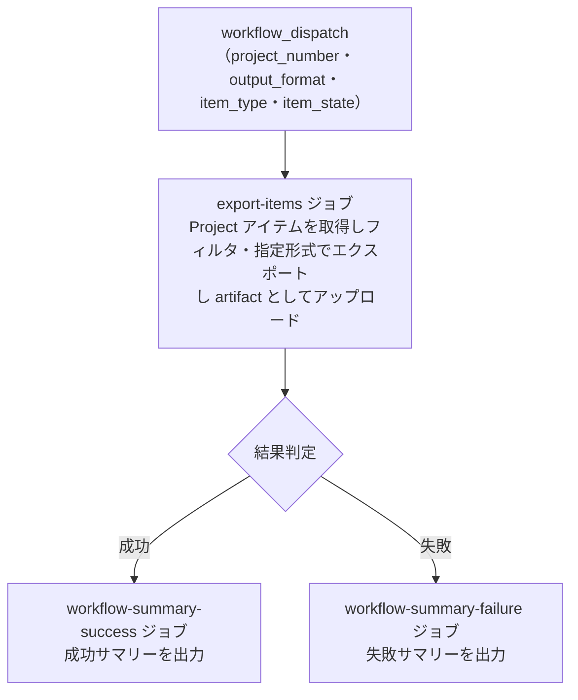

# ④ 📤 Project アイテム エクスポート

<!-- START doctoc -->
<!-- END doctoc -->

> **⚠️ このワークフローは [⑩ 統合プロジェクト分析](10-analyze-project) に統合されました。** `report_types: export` を選択して実行してください。

指定した GitHub `Project` に紐づく `Issue` / `Pull Request` の一覧を取得し、エクスポートします。

## ✅ 前提

このワークフローを実行する前に、クイックスタートを完了してください。

- [クイックスタート（GUI）](../quickstart-gui)
- [クイックスタート（CLI）](../quickstart-cli)

## 📖 使い方

1. `Actions` タブを開く
2. `④ Project アイテム エクスポート` を選択
3. `Run workflow` をクリック
4. パラメータを入力して実行

## ⚙️ パラメータ

| パラメータ | 説明 | 必須 | タイプ | 例 |
|------------|------|:----:|--------|-----|
| `project_number` | 対象 `Project` の Number | ✅ | `number` | `1` |
| `output_format` | 出力形式 | ✅ | `choice` | `markdown`（デフォルト） |
| `item_type` | 対象アイテムの種別 | ✅ | `choice` | `all`（デフォルト） |
| `item_state` | 取得するアイテムの状態 | ✅ | `choice` | `all`（デフォルト） |

### アイテム種別

| 選択肢 | 説明 |
|--------|------|
| `all` | `Issue` と `Pull Request` の両方 |
| `issues` | `Issue` のみ |
| `prs` | `Pull Request` のみ |

### アイテム状態

| 選択肢 | 説明 |
|--------|------|
| `open` | オープン状態のもの |
| `closed` | クローズ状態のもの（CLOSED + MERGED を含む） |
| `all` | すべての状態 |

### 出力形式

| 形式 | 説明 | 拡張子 |
|------|------|--------|
| `markdown` | 人が読みやすいテーブル形式 | `.md` |
| `csv` | カンマ区切り形式（RFC 4180 準拠、`"` で囲む） | `.csv` |
| `tsv` | タブ区切り形式 | `.tsv` |
| `json` | 構造化データ形式 | `.json` |

> **Note:** `markdown` 形式では、タイトル・ラベル・アサインに含まれる Markdown 特殊文字（`` \ ` * _ [ ] < > ~ | ``）を自動的にエスケープします。`csv` 形式は jq の `@csv` フィルタにより RFC 4180 準拠でフィールドがダブルクォートで囲まれるため、記号を含むデータも安全に出力されます。

## 📋 出力項目

| 項目 | 説明 |
|------|------|
| type | 種別（`Issue` / `PullRequest`） |
| number | 番号 |
| title | タイトル |
| url | URL |
| state | 状態（OPEN / CLOSED / MERGED） |
| repository | リポジトリ名 |
| author | 作成者 |
| assignees | アサイン |
| labels | ラベル |
| created_at | 作成日時 |
| updated_at | 更新日時 |

> **Note:** DraftIssue は出力対象外です。

## 🔢 並び順

| 出力形式 | 並び順 |
|----------|--------|
| `markdown` | `Issue` → `Pull Request` の順にセクション分けして出力。各セクション内は API 返却順 |
| `csv` | API 返却順（種別の分離なし） |
| `tsv` | API 返却順（種別の分離なし） |
| `json` | API 返却順（種別の分離なし） |

- スクリプト内に明示的なソート処理は存在しません。GitHub GraphQL API が返す順序がそのまま維持されます
- `markdown` 形式のみ、`Issue` セクションと `Pull Request` セクションに分離して出力されます
- API の返却順は、GraphQL API でのカーソルベースページネーション（100件ずつ）で取得した順序であり、通常は Project ボード上の並び順に依存します

## 📂 出力先

- **artifact:** エクスポートファイルが artifact としてダウンロード可能です（保持期間: 7日）

## 📊 処理フロー

