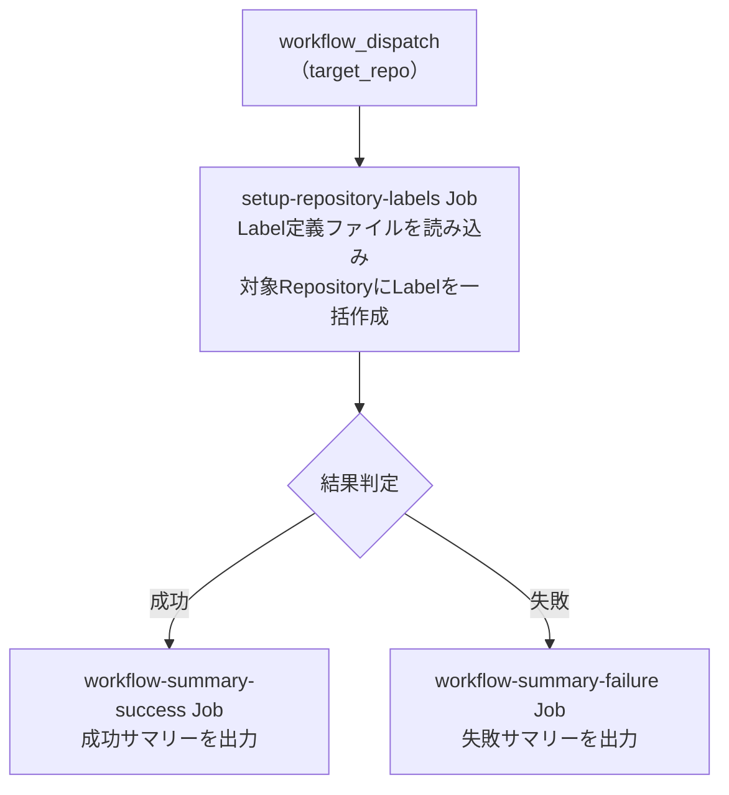

# ④ Issue Label 一括作成

指定 Repository に対して、設定ファイルで定義した Issue Label を一括作成します。
既存 Label と同名の Label が存在する場合はスキップします。

<!-- START doctoc generated TOC please keep comment here to allow auto update -->
<!-- DON'T EDIT THIS SECTION, INSTEAD RE-RUN doctoc TO UPDATE -->

<details><summary>（ここをクリック）目次</summary><ul>
<li><a href="#-%E5%89%8D%E6%8F%90">✅ 前提</a></li>

<li><a href="#-%E4%BD%BF%E3%81%84%E6%96%B9">📖 使い方</a></li>

<li><a href="#-%E3%83%91%E3%83%A9%E3%83%A1%E3%83%BC%E3%82%BF">⚙️ パラメータ</a></li>

<li><a href="#-%E5%87%A6%E7%90%86%E3%83%95%E3%83%AD%E3%83%BC">📊 処理フロー</a></li>

<li><a href="#-workflow-%E4%BB%95%E6%A7%98">🔧 Workflow 仕様</a></li>

<li><a href="#-%E9%96%A2%E9%80%A3%E3%82%B9%E3%82%AF%E3%83%AA%E3%83%97%E3%83%88">📜 関連スクリプト</a></li>
</ul></details>

<!-- END doctoc generated TOC please keep comment here to allow auto update -->

## ✅ 前提

この Workflow を実行する前に、クイックスタートを完了してください。

- [クイックスタート（GUI）](../getting-started/quickstart-gui.md)
- [クイックスタート（CLI）](../getting-started/quickstart-cli.md)

## 📖 使い方

1. `Actions` タブを開く
2. `④ Issue Label 一括作成` を選択
3. `Run workflow` をクリック
4. パラメータを入力して実行

## ⚙️ パラメータ

| パラメータ | 説明 | 必須 | タイプ | 例 |
|------------|------|:----:|--------|-----|
| `target_repo` | 対象 Repository（owner/repo 形式） | ✅ | `string` | `myorg/myrepo` |

> **Note:** 既存 Label と同名の Label が存在する場合はスキップされます。定義ファイルに含まれない既存 Label は削除されません。追加のみの安全設計です。

## 📊 処理フロー



## 🔧 Workflow 仕様

### ファイル

`.github/workflows/04-setup-repository-labels.yml`

### トリガー

`workflow_dispatch`（手動実行）

### 環境変数

| 環境変数 | ソース | 説明 |
|----------|--------|------|
| `GH_TOKEN` | `secrets.PROJECT_PAT` | GitHub PAT（`repo` または `public_repo` Scope） |
| `TARGET_REPO` | `inputs.target_repo` | 対象 Repository  |
| `PROJECT_PAT` | `secrets.PROJECT_PAT` | PAT 形式検証用（`ghp_` または `github_pat_` で始まるか検証） |

> **Note:** `PROJECT_PAT` が未設定または無効な形式の場合、 PAT を使用するステップはスキップされます。

### Job 構成

```
.github/workflows/04-setup-repository-labels.yml
  ├── setup-repository-labels Job
  │   └── scripts/setup-repository-labels.sh     # Issue Label 一括作成
  ├── workflow-summary-failure Job（失敗時）
  │   └── .github/actions/workflow-summary       # 失敗サマリー出力
  └── workflow-summary-success Job（成功時）
      └── .github/actions/workflow-summary       # 成功サマリー出力
```

## 📜 関連スクリプト

- [setup-repository-labels.sh](../scripts/setup-repository-labels.md) — Issue Label 一括作成スクリプト
