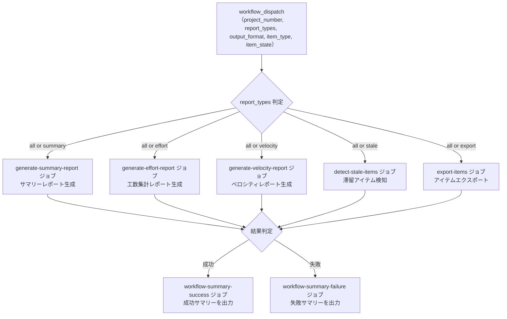

# ⑤ 📊 統合プロジェクト分析

指定した GitHub `Project` のアイテムを走査し、滞留アイテム検知・プロジェクトサマリーレポート・工数集計レポート・ベロシティレポート・アイテムエクスポートを 1 回の実行でまとめて生成します。`report_types` パラメータで実行する機能を選択することも可能です。

<!-- START doctoc generated TOC please keep comment here to allow auto update -->
<!-- DON'T EDIT THIS SECTION, INSTEAD RE-RUN doctoc TO UPDATE -->
**Table of Contents**

<details><summary>Table of Contents</summary>\n<ul>\n
<li><a href="#-%E5%89%8D%E6%8F%90">✅ 前提</a></li>
\n
<li><a href="#-%E4%BD%BF%E3%81%84%E6%96%B9">📖 使い方</a></li>
\n
<li><a href="#-%E3%83%91%E3%83%A9%E3%83%A1%E3%83%BC%E3%82%BF">⚙️ パラメータ</a></li>
\n
<li><a href="#-%E6%BB%9E%E7%95%99%E3%82%A2%E3%82%A4%E3%83%86%E3%83%A0%E6%A4%9C%E7%9F%A5stale">🔍 滞留アイテム検知（stale）</a></li>
\n
<li><a href="#-%E3%83%97%E3%83%AD%E3%82%B8%E3%82%A7%E3%82%AF%E3%83%88%E3%82%B5%E3%83%9E%E3%83%AA%E3%83%BC%E3%83%AC%E3%83%9D%E3%83%BC%E3%83%88summary">📊 プロジェクトサマリーレポート（summary）</a></li>
\n
<li><a href="#-%E5%B7%A5%E6%95%B0%E9%9B%86%E8%A8%88%E3%83%AC%E3%83%9D%E3%83%BC%E3%83%88effort">📊 工数集計レポート（effort）</a></li>
\n
<li><a href="#-%E3%83%99%E3%83%AD%E3%82%B7%E3%83%86%E3%82%A3%E3%83%AC%E3%83%9D%E3%83%BC%E3%83%88velocity">📈 ベロシティレポート（velocity）</a></li>
\n
<li><a href="#-%E3%82%A2%E3%82%A4%E3%83%86%E3%83%A0%E3%82%A8%E3%82%AF%E3%82%B9%E3%83%9D%E3%83%BC%E3%83%88export">📤 アイテムエクスポート（export）</a></li>
\n
<li><a href="#-%E3%82%A2%E3%83%BC%E3%83%86%E3%82%A3%E3%83%95%E3%82%A1%E3%82%AF%E3%83%88%E3%81%AE%E5%85%AC%E9%96%8B%E7%AF%84%E5%9B%B2%E3%81%AB%E9%96%A2%E3%81%99%E3%82%8B%E6%B3%A8%E6%84%8F%E4%BA%8B%E9%A0%85">⚠️ アーティファクトの公開範囲に関する注意事項</a></li>
\n
<li><a href="#-%E5%87%A6%E7%90%86%E3%83%95%E3%83%AD%E3%83%BC">📊 処理フロー</a></li>
\n
<li><a href="#-%E3%83%AF%E3%83%BC%E3%82%AF%E3%83%95%E3%83%AD%E3%83%BC%E4%BB%95%E6%A7%98">🔧 ワークフロー仕様</a></li>
\n
<li><a href="#-%E9%96%A2%E9%80%A3%E3%82%B9%E3%82%AF%E3%83%AA%E3%83%97%E3%83%88">📜 関連スクリプト</a></li>
\n</ul>\n</details>

<!-- END doctoc generated TOC please keep comment here to allow auto update -->

## ✅ 前提

このワークフローを実行する前に、クイックスタートを完了してください。

- [クイックスタート（GUI）](../quickstart-gui)
- [クイックスタート（CLI）](../quickstart-cli)

## 📖 使い方

1. `Actions` タブを開く
2. `⑤ 統合プロジェクト分析` を選択
3. `Run workflow` をクリック
4. パラメータを入力して実行

## ⚙️ パラメータ

| パラメータ | 説明 | 必須 | タイプ | デフォルト | 例 |
|------------|------|:----:|--------|-----------|-----|
| `project_number` | 対象 `Project` の Number | ✅ | `number` | — | `1` |
| `report_types` | 実行する機能 | ✅ | `choice` | `all` | `stale` |
| `output_format` | 出力形式 | ✅ | `choice` | `json` | `markdown` |
| `item_type` | 対象アイテムの種別 | ✅ | `choice` | `all` | `issues` |
| `item_state` | 対象アイテムの状態 | ✅ | `choice` | `all` | `open` |
| `retention_days` | アーティファクトの保持日数（1〜7） | ✅ | `number` | `7` | `3` |

### `report_types` の選択肢

| 値 | 説明 |
|------|------|
| `all` | 全機能（滞留検知 + サマリー + 工数集計 + ベロシティ + エクスポート）を実行 |
| `stale` | 滞留アイテム検知のみ実行 |
| `summary` | プロジェクトサマリーレポートのみ実行 |
| `effort` | 工数集計レポートのみ実行 |
| `velocity` | ベロシティレポートのみ実行 |
| `export` | アイテムエクスポートのみ実行 |

### `output_format` の選択肢

| 値 | 説明 |
|------|------|
| `json` | JSON 形式（構造化データ、デフォルト） |
| `markdown` | Markdown 形式（テーブル・チャート付きリッチレポート） |
| `csv` | CSV 形式（元データのフラット出力、外部ツール分析向け） |
| `tsv` | TSV 形式（元データのフラット出力、外部ツール分析向け） |

### `item_type` の選択肢

| 値 | 説明 |
|------|------|
| `all` | Issue と Pull Request の両方を対象 |
| `issues` | Issue のみを対象 |
| `prs` | Pull Request のみを対象 |

### `item_state` の選択肢

| 値 | 説明 |
|------|------|
| `all` | 全状態のアイテムを対象 |
| `open` | Open 状態のアイテムのみを対象 |
| `closed` | Closed / Merged 状態のアイテムのみを対象 |

---

## 🔍 滞留アイテム検知（stale）

一定期間更新がない「滞留アイテム」を検知・レポートします。

### 滞留判定ルール

#### ステータス別閾値

| ステータス | 閾値（日） | 説明 |
|-----------|:---------:|------|
| `Todo` | 14 | 着手予定のまま 2 週間以上経過 |
| `In Progress` | 7 | 作業中のまま 1 週間以上更新なし |
| `In Review` | 3 | レビュー中のまま 3 日以上更新なし |

#### 判定基準

- **更新日時:** Issue / PR の `updatedAt`（コメント・コミット等のアクティビティを反映）
- **判定式:** `(現在日時 - コンテンツ更新日時) >= ステータス別閾値`

#### 除外条件

| 条件 | 理由 |
|------|------|
| ステータスが `Done` | 完了済みのため検知不要 |
| ステータスが `Backlog` | 未着手のバックログは滞留とみなさない |
| `on-hold` ラベル | 意図的に保留されている |
| `blocked` ラベル | 外部要因で進行不可 |
| `DraftIssue` | プロジェクト内メモであり追跡対象外 |

> **Note:** 閾値・除外ラベルを変更する場合は、`scripts/detect-stale-items.sh` 内の定数を直接編集してください。

### 出力

#### Workflow Summary（Markdown テーブル）

ステータス別に滞留アイテムの一覧を Markdown テーブル形式で出力します。

出力項目:

| 項目 | 説明 |
|------|------|
| # | Issue / PR 番号（リンク付き） |
| タイトル | アイテムのタイトル |
| リポジトリ | 所属リポジトリ |
| アサイン | 担当者 |
| 最終更新 | 最終更新日 |
| 経過日数 | 最終更新からの経過日数 |

#### Artifact

`stale-items-report.{json|md|csv|tsv}` が artifact としてダウンロード可能です（保持期間: 7 日）。出力形式は `output_format` パラメータで選択できます。

---

## 📊 プロジェクトサマリーレポート（summary）

ステータス別・担当者別・ラベル別の集計レポートを生成します。

### 集計項目

#### 必須項目

| # | 項目 | 説明 |
|---|------|------|
| 1 | 概要サマリー | 総アイテム数、Issue/PR 別件数 |
| 2 | ステータス別件数 | 各ステータスの件数と割合（Mermaid 円グラフ付き） |
| 3 | 担当者別件数 | 各担当者のアイテム数と In Progress / In Review 内訳 |
| 4 | ラベル別件数 | 各ラベルのアイテム数 |

#### オプション項目（カスタムフィールド使用時）

| # | 項目 | 説明 |
|---|------|------|
| 5 | 工数サマリー | ステータス別の見積もり工数合計・実績工数合計 |
| 6 | 期日超過アイテム | 終了期日を過ぎた未完了アイテムの一覧 |

> **Note:** カスタムフィールドが設定されていないプロジェクトでは、オプション項目は自動的に非表示となります。

### 出力

#### Workflow Summary（Markdown + Mermaid）

ステータス別・担当者別・ラベル別の集計結果を Markdown テーブル形式で出力します。
ステータス別の分布は Mermaid 円グラフでも可視化されます。

出力項目:

| セクション | 内容 |
|-----------|------|
| ステータス別 | ステータス名、件数、割合（テーブル + Mermaid 円グラフ） |
| 担当者別 | 担当者名、件数、In Progress 数、In Review 数 |
| ラベル別 | ラベル名、件数 |
| 工数サマリー | ステータス別の見積もり・実績工数合計（オプション） |
| 期日超過アイテム | Issue/PR 番号、タイトル、ステータス、担当者、終了期日、超過日数（オプション） |

#### Artifact

`report-{number}-summary.{json|md|csv|tsv}` が artifact としてダウンロード可能です（保持期間: 7 日）。出力形式は `output_format` パラメータで選択できます。

---

## 📊 工数集計レポート（effort）

見積もり工数・実績工数を多角的に集計・分析し、工数管理を支援するレポートを生成します。

### 集計項目

#### 必須項目

| # | 項目 | 説明 |
|---|------|------|
| 1 | 全体サマリー | 総見積もり工数、総実績工数、全体乖離率、工数入力率 |
| 2 | 担当者別工数 | 担当者ごとの見積もり・実績工数、乖離率（Mermaid 円グラフ付き） |
| 3 | ステータス別工数 | ステータスごとの見積もり・実績工数、消化率 |
| 4 | 乖離アイテム | 見積もりと実績の乖離が大きいアイテム一覧（上位 10 件） |
| 5 | 工数未入力アイテム | 見積もり・実績ともに未入力のアイテム一覧 |

#### オプション項目（日付フィールド使用時）

| # | 項目 | 説明 |
|---|------|------|
| 6 | リードタイム分析 | 計画・実績リードタイム、乖離日数、日あたり工数 |

> **Note:** 日付フィールド（開始予定/実績、終了予定/実績）が設定されていないプロジェクトでは、リードタイム分析は自動的に非表示となります。

### 出力

#### Workflow Summary（Markdown + Mermaid）

工数集計結果を Markdown テーブル形式で出力します。
担当者別の実績工数分布は Mermaid 円グラフでも可視化されます。

出力項目:

| セクション | 内容 |
|-----------|------|
| 全体サマリー | 総見積もり工数、総実績工数、全体乖離率、工数入力率 |
| 担当者別工数 | 担当者名、アイテム数、見積もり・実績工数、乖離率（テーブル + Mermaid 円グラフ） |
| ステータス別工数 | ステータス名、アイテム数、見積もり・実績工数、消化率 |
| 乖離アイテム | Issue/PR 番号、タイトル、担当者、見積もり・実績工数、乖離率 |
| リードタイム分析 | Issue/PR 番号、タイトル、計画・実績日数、乖離日数、日あたり工数（オプション） |
| 工数未入力アイテム | Issue/PR 番号、タイトル、ステータス、担当者 |

#### Artifact

`report-{number}-effort.{json|md|csv|tsv}` が artifact としてダウンロード可能です（保持期間: 7 日）。出力形式は `output_format` パラメータで選択できます。

---

## 📈 ベロシティレポート（velocity）

Done ステータスのアイテムを週別に集計し、チームのベロシティ（完了数・完了工数）の推移を可視化します。

### 集計項目

#### 必須項目

| # | 項目 | 説明 |
|---|------|------|
| 1 | 概要サマリー | 集計期間、Done アイテム数、平均ベロシティ（件/週） |
| 2 | 週別ベロシティ | 各週の完了アイテム数（Mermaid 棒グラフ付き） |
| 3 | 担当者別ベロシティ | 担当者ごとの完了数合計（Mermaid 円グラフ付き） |

#### オプション項目（工数フィールド使用時）

| # | 項目 | 説明 |
|---|------|------|
| 4 | 週別完了工数 | 各週の完了工数（Mermaid 棒グラフ付き） |
| 5 | 平均完了工数 | 平均完了工数（h/週） |
| 6 | 担当者別完了工数 | 担当者ごとの完了工数合計 |

> **Note:** 実績工数(h) フィールドが設定されていないプロジェクトでは、工数関連の項目は自動的に非表示となります。

### ベロシティ算出ルール

| 項目 | 説明 |
|------|------|
| 対象アイテム | Status が `Done` のアイテム |
| 集計期間 | 直近 8 週間（スクリプト内定数 `VELOCITY_WEEKS` で変更可能） |
| 完了日判定 | ProjectV2Item の `updatedAt`（Project 上での最終更新日時）を使用 |
| 週の区切り | ISO 週（月曜始まり） |

### 出力

#### Workflow Summary（Markdown + Mermaid）

週別ベロシティを Markdown テーブルおよび Mermaid 棒グラフで出力します。
担当者別の完了数分布は Mermaid 円グラフでも可視化されます。

出力項目:

| セクション | 内容 |
|-----------|------|
| 概要サマリー | 集計期間、Done アイテム数、平均ベロシティ |
| 週別ベロシティ | 週ラベル、期間、完了数、完了工数（テーブル + Mermaid 棒グラフ） |
| 担当者別ベロシティ | 担当者名、完了数、完了工数（テーブル + Mermaid 円グラフ） |

#### Artifact

`report-{number}-velocity.{json|md|csv|tsv}` が artifact としてダウンロード可能です（保持期間: 7 日）。出力形式は `output_format` パラメータで選択できます。

---

## 📤 アイテムエクスポート（export）

Project に紐づく Issue / Pull Request の一覧を取得し、エクスポートします。DraftIssue は出力対象外です。

> **Note:** この機能はワークフロー④（Project アイテム エクスポート）から統合されたものです。

### 出力項目

| 項目 | 説明 |
|------|------|
| type | 種別（`Issue` / `PullRequest`） |
| number | 番号 |
| title | タイトル |
| url | URL |
| state | 状態（OPEN / CLOSED / MERGED） |
| repository | リポジトリ名 |
| author | 作成者 |
| assignees | アサイン |
| labels | ラベル |
| created_at | 作成日時 |
| updated_at | 更新日時 |

### 出力

#### Artifact

`export-{number}-items.{json|md|csv|tsv}` が artifact としてダウンロード可能です（保持期間: 7 日）。出力形式は `output_format` パラメータで選択できます。

---

## ⚠️ アーティファクトの公開範囲に関する注意事項

このワークフローで生成されるレポートは `GitHub Actions` の **アーティファクト** としてアップロードされます。アーティファクトの公開範囲について、以下の点にご注意ください。

### アーティファクトのアクセス範囲

- アーティファクトは **リポジトリの `Actions` タブにアクセスできるユーザーであれば誰でもダウンロード可能** です
- **Public リポジトリの場合、第三者（GitHub アカウントを持つ任意のユーザー）もダウンロード可能です**
- Public リポジトリのフォークは Private にできないため、**フォーク先でも同様のリスク** があります
- レポートには `PROJECT_PAT` を使って取得した `GitHub Projects` のデータが含まれており、**`GitHub Projects` を直接参照する権限がないユーザーでもレポート経由でデータを閲覧できてしまう可能性** があります

> **Warning:** レポートには担当者名・工数・ステータスなどプロジェクト管理上の情報が含まれます。Public リポジトリで運用する場合は、これらの情報が第三者に公開されるリスクを十分にご理解ください。

### Actions のアクセス制限に関する調査結果

GitHub の現行仕様では、**アーティファクトのダウンロード対象者を特定のユーザーやロールに制限する機能は存在しません**。以下にプラットフォーム側の設定状況と代替手段をまとめます。

#### リポジトリ Settings > Actions > General

| 設定項目 | 制御できること | アーティファクトへの影響 |
|----------|--------------|----------------------|
| Actions の実行権限 | 許可するアクション・ワークフローの制限 | ワークフロー実行自体は制限可能だが、生成済みアーティファクトのダウンロードは制限できない |
| ワークフロー権限（GITHUB_TOKEN） | デフォルトのトークン権限スコープ | アーティファクトのアクセス範囲には影響しない |

#### actions/upload-artifact v4 のパラメータ

`actions/upload-artifact` v4 には、アクセス範囲やダウンロード権限を制御するパラメータは **存在しません**。`retention-days`（保持日数）、`compression-level`（圧縮レベル）等の設定のみ対応しています。

#### Organization レベルの設定

Organization では Actions の実行ポリシーや GITHUB_TOKEN のデフォルト権限を Organization 全体で強制できますが、**アーティファクトのダウンロード対象者を制限する設定は Organization レベルでも存在しません**。

#### 代替手段

機密性のあるレポートを配布する場合、以下の代替手段を検討してください。

| 方法 | 概要 | 備考 |
|------|------|------|
| Issue / PR コメントへの投稿 | レポート内容をコメントとして投稿する | リポジトリのアクセス権で制御されるが、Public リポジトリでは閲覧可能 |
| 外部クラウドストレージ（S3, GCS 等） | IAM や署名付き URL で細粒度のアクセス制御が可能 | 追加のインフラ・認証情報管理が必要 |
| GitHub Pages（プライベート公開） | リポジトリ読み取り権限者のみアクセス可能 | GitHub Pro / Team / Enterprise Cloud 等の有料プランが必要（[公式ドキュメント](https://docs.github.com/en/pages/getting-started-with-github-pages/changing-the-visibility-of-your-github-pages-site)） |
| ワークフロー内での暗号化 | アーティファクト自体を暗号化し、復号鍵を持つ人のみ閲覧可能にする | 鍵管理の複雑さ、利便性の低下 |

> **参考リンク:**
>
> - [Downloading workflow artifacts - GitHub Docs](https://docs.github.com/en/actions/managing-workflow-runs/downloading-workflow-artifacts)
> - [Managing GitHub Actions settings for a repository - GitHub Docs](https://docs.github.com/en/repositories/managing-your-repositorys-settings-and-features/enabling-features-for-your-repository/managing-github-actions-settings-for-a-repository)
> - [actions/upload-artifact - GitHub](https://github.com/actions/upload-artifact)
> - [Disabling or limiting GitHub Actions for your organization - GitHub Docs](https://docs.github.com/en/organizations/managing-organization-settings/disabling-or-limiting-github-actions-for-your-organization)

---

## 📊 処理フロー



## 🔧 ワークフロー仕様

### ファイル

`.github/workflows/05-analyze-project.yml`

### トリガー

`workflow_dispatch`（手動実行）

### 環境変数

| 環境変数 | ソース | 説明 |
|----------|--------|------|
| `GH_TOKEN` | `secrets.PROJECT_PAT` | GitHub PAT（Projects 操作権限） |
| `PROJECT_OWNER` | `github.repository_owner` | Project オーナー |
| `PROJECT_NUMBER` | `inputs.project_number` | 対象 Project Number |
| `OUTPUT_FORMAT` | `inputs.output_format` | 出力形式 |
| `ITEM_TYPE` | `inputs.item_type` | アイテム種別フィルタ |
| `ITEM_STATE` | `inputs.item_state` | アイテム状態フィルタ |

### ジョブ構成

```
.github/workflows/05-analyze-project.yml
  ├── validate-inputs ジョブ
  │   └── retention_days の範囲検証（1〜7）
  ├── generate-summary-report ジョブ（all or summary 選択時）
  │   └── scripts/generate-summary-report.sh       # サマリーレポート生成
  ├── generate-effort-report ジョブ（all or effort 選択時）
  │   └── scripts/generate-effort-report.sh        # 工数集計レポート生成
  ├── generate-velocity-report ジョブ（all or velocity 選択時）
  │   └── scripts/generate-velocity-report.sh      # ベロシティレポート生成
  ├── detect-stale-items ジョブ（all or stale 選択時）
  │   └── scripts/detect-stale-items.sh            # 滞留アイテム検知
  ├── export-items ジョブ（all or export 選択時）
  │   └── scripts/export-project-items.sh          # アイテムエクスポート
  ├── workflow-summary-failure ジョブ（失敗時）
  │   └── .github/actions/workflow-summary         # 失敗サマリー出力
  └── workflow-summary-success ジョブ（成功時）
      └── .github/actions/workflow-summary         # 成功サマリー出力
```

## 📜 関連スクリプト

- [generate-summary-report.sh](../scripts/generate-summary-report) — サマリーレポート生成スクリプト
- [generate-effort-report.sh](../scripts/generate-effort-report) — 工数集計レポート生成スクリプト
- [generate-velocity-report.sh](../scripts/generate-velocity-report) — ベロシティレポート生成スクリプト
- [detect-stale-items.sh](../scripts/detect-stale-items) — 滞留アイテム検知スクリプト
- [export-project-items.sh](../scripts/export-project-items) — アイテムエクスポートスクリプト
