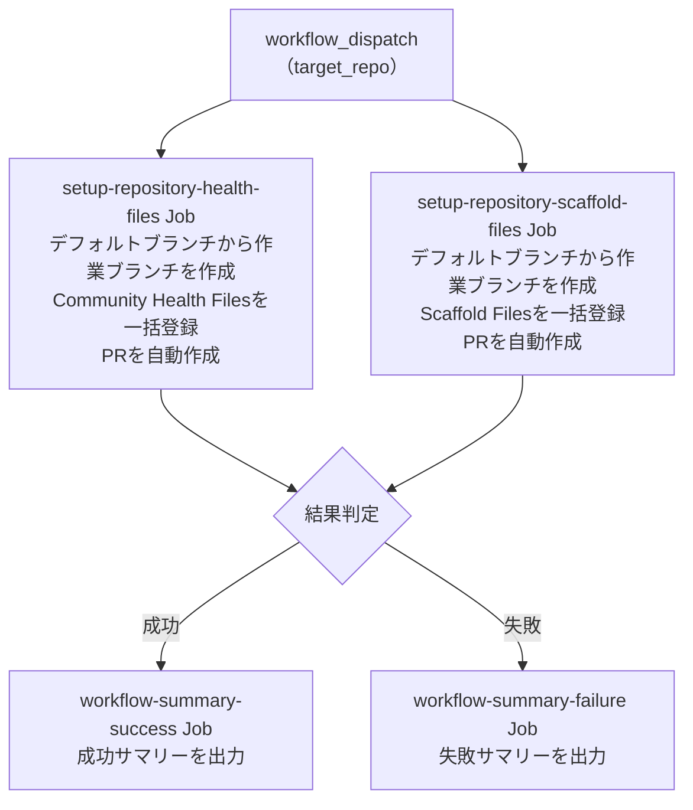

# ⑤ 初期ファイル一括作成

指定 Repository に対して、Community Health Files および開発に必要な Scaffold ファイルを空ファイルとして一括登録します。
既にファイルが存在する場合はスキップし、作成ファイルがあればデフォルトブランチへの PR を自動作成します。

<!-- START doctoc generated TOC please keep comment here to allow auto update -->
<!-- DON'T EDIT THIS SECTION, INSTEAD RE-RUN doctoc TO UPDATE -->

<details><summary>（ここをクリック）目次</summary><ul>
<li><a href="#-%E5%89%8D%E6%8F%90">✅ 前提</a></li>

<li><a href="#-%E4%BD%BF%E3%81%84%E6%96%B9">📖 使い方</a></li>

<li><a href="#-%E3%83%91%E3%83%A9%E3%83%A1%E3%83%BC%E3%82%BF">⚙️ パラメータ</a></li>

<li><a href="#-%E5%87%A6%E7%90%86%E3%83%95%E3%83%AD%E3%83%BC">📊 処理フロー</a></li>

<li><a href="#-workflow-%E4%BB%95%E6%A7%98">🔧 Workflow 仕様</a></li>

<li><a href="#-%E9%96%A2%E9%80%A3%E3%82%B9%E3%82%AF%E3%83%AA%E3%83%97%E3%83%88">📜 関連スクリプト</a></li>
</ul></details>

<!-- END doctoc generated TOC please keep comment here to allow auto update -->

## ✅ 前提

この Workflow を実行する前に、クイックスタートを完了してください。

- [クイックスタート（GUI）](../getting-started/quickstart-gui.md)
- [クイックスタート（CLI）](../getting-started/quickstart-cli.md)

## 📖 使い方

1. `Actions` タブを開く
2. `⑤ 初期ファイル一括作成` を選択
3. `Run workflow` をクリック
4. パラメータを入力して実行

## ⚙️ パラメータ

| パラメータ | 説明 | 必須 | タイプ | デフォルト | 例 |
|------------|------|:----:|--------|------------|-----|
| `target_repo` | 対象 Repository（owner/repo 形式） | ✅ | `string` | — | `myorg/myrepo` |
| `setup_types` | 実行するセットアップタイプ | ✅ | `choice` | `all` | `health` / `scaffold` |

`setup_types` の選択肢:

| 値 | 説明 |
|----|------|
| `all` | 全機能を実行（Community Health Files + Scaffold ファイル） |
| `health` | Community Health Files のみ |
| `scaffold` | Scaffold ファイルのみ |

> **Note:** 対象リポジトリに同名ファイルが既に存在する場合はスキップされます（上書き禁止）。全ファイルが既に存在する場合は PR を作成しません。

### 対象ファイル（Community Health Files）

対象ファイルは [`scripts/config/repo-health-file-definitions.json`](../../scripts/config/repo-health-file-definitions.json) で定義されています。
JSON ファイルを編集することで、スクリプトを変更せずに登録対象をカスタマイズできます。

| ファイル | パス |
|----------|------|
| `CODE_OF_CONDUCT.md` | `.github/CODE_OF_CONDUCT.md` |
| `CONTRIBUTING.md` | `.github/CONTRIBUTING.md` |
| `GOVERNANCE.md` | `.github/GOVERNANCE.md` |
| `SECURITY.md` | `.github/SECURITY.md` |
| `SUPPORT.md` | `.github/SUPPORT.md` |
| `PULL_REQUEST_TEMPLATE.md` | `.github/PULL_REQUEST_TEMPLATE.md` |
| Issue テンプレート設定 | `.github/ISSUE_TEMPLATE/config.yml` |

### 対象ファイル（Scaffold Files）

対象ファイルは [`scripts/config/repo-scaffold-definitions.json`](../../scripts/config/repo-scaffold-definitions.json) で定義されています。
JSON ファイルを編集することで、スクリプトを変更せずに登録対象をカスタマイズできます。

| ファイル | パス |
|----------|------|
| `.gitignore` | `.amazonq/.gitignore` |
| `.gitkeep` | `.amazonq/.gitkeep` |
| `.gitignore` | `.claude/.gitignore` |
| `.gitkeep` | `.claude/.gitkeep` |
| `.gitignore` | `.cline/.gitignore` |
| `.gitkeep` | `.cline/.gitkeep` |
| `.gitignore` | `.codex/.gitignore` |
| `.gitkeep` | `.codex/.gitkeep` |
| `.gitignore` | `.cursor/.gitignore` |
| `.gitkeep` | `.cursor/.gitkeep` |
| `.gitignore` | `.gemini/.gitignore` |
| `.gitkeep` | `.gemini/.gitkeep` |
| `copilot-instructions.md` | `.github/copilot-instructions.md` |
| `release.yml` | `.github/release.yml` |
| `.gitkeep` | `.idea/.gitkeep` |
| `.gitkeep` | `.vscode/.gitkeep` |
| `.gitignore` | `.windsurf/.gitignore` |
| `.gitkeep` | `.windsurf/.gitkeep` |
| `.gitignore` | `.gitignore` |
| `README.md` | `README.md` |

## 📊 処理フロー



## 🔧 Workflow 仕様

### ファイル

`.github/workflows/05-setup-repository-files.yml`

### トリガー

`workflow_dispatch`（手動実行）

### 環境変数

| 環境変数 | ソース | 説明 |
|----------|--------|------|
| `GH_TOKEN` | `secrets.PROJECT_PAT` | GitHub PAT（`repo` Scope） |
| `TARGET_REPO` | `inputs.target_repo` | 対象 Repository |
| `PROJECT_PAT` | `secrets.PROJECT_PAT` | PAT 形式検証用（`ghp_` または `github_pat_` で始まるか検証） |

> **Note:** `PROJECT_PAT` が未設定または無効な形式の場合、 PAT を使用するステップはスキップされます。

### Job 構成

```
.github/workflows/05-setup-repository-files.yml
  ├── setup-repository-health-files Job
  │   └── scripts/setup-repository-health-files.sh     # Community Health Files 一括登録
  ├── setup-repository-scaffold-files Job
  │   └── scripts/setup-repository-scaffold-files.sh   # Scaffold ファイル一括登録
  ├── workflow-summary-failure Job（失敗時）
  │   └── .github/actions/workflow-summary            # 失敗サマリー出力
  └── workflow-summary-success Job（成功時）
      └── .github/actions/workflow-summary            # 成功サマリー出力
```

## 📜 関連スクリプト

- [setup-repository-health-files.sh](../scripts/setup-repository-health-files.md) — Community Health Files 一括登録スクリプト
- [setup-repository-scaffold-files.sh](../scripts/setup-repository-scaffold-files.md) — Scaffold ファイル一括登録スクリプト
