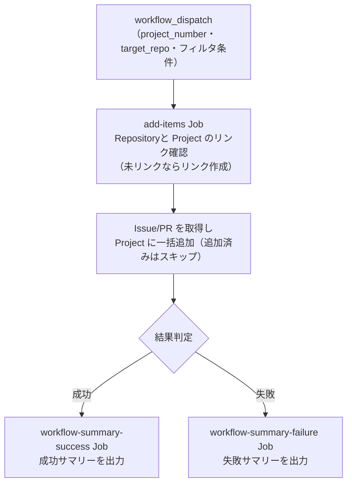

# ⑥ Issue/PR 一括紐付け

Project に Repository の `Issue`/`PR` を一括追加します。
また、 Repository と Project のリンク（紐付け）を自動的に行い、 Repository の `Projects` タブから Project へアクセスできるようにします。

<!-- START doctoc generated TOC please keep comment here to allow auto update -->
<!-- DON'T EDIT THIS SECTION, INSTEAD RE-RUN doctoc TO UPDATE -->

<details><summary>（ここをクリック）目次</summary><ul>
<li><a href="#-%E5%89%8D%E6%8F%90">✅ 前提</a></li>

<li><a href="#-%E4%BD%BF%E3%81%84%E6%96%B9">📖 使い方</a></li>

<li><a href="#-%E3%83%91%E3%83%A9%E3%83%A1%E3%83%BC%E3%82%BF">⚙️ パラメータ</a></li>

<li><a href="#-%E5%87%A6%E7%90%86%E3%83%95%E3%83%AD%E3%83%BC">📊 処理フロー</a></li>

<li><a href="#-workflow-%E4%BB%95%E6%A7%98">🔧 Workflow 仕様</a></li>

<li><a href="#-%E9%96%A2%E9%80%A3%E3%82%B9%E3%82%AF%E3%83%AA%E3%83%97%E3%83%88">📜 関連スクリプト</a></li>
</ul></details>

<!-- END doctoc generated TOC please keep comment here to allow auto update -->

## ✅ 前提

この Workflow を実行する前に、クイックスタートを完了してください。

- [クイックスタート（GUI）](../getting-started/quickstart-gui.md)
- [クイックスタート（CLI）](../getting-started/quickstart-cli.md)

## 📖 使い方

1. `Actions` タブを開く
2. `⑥ Issue/PR 一括紐付け` を選択
3. `Run workflow` をクリック
4. パラメータを入力して実行

## ⚙️ パラメータ

| パラメータ | 説明 | 必須 | タイプ | 例 |
|------------|------|:----:|--------|-----|
| `project_number` | 対象 Project の Number | ✅ | `number` | `1` |
| `target_repo` | 対象 Repository（`owner/repo` 形式） | ✅ | `string` | `myorg/myrepo` |
| `item_type` | 対象 Item の種別 | ✅ | `choice` | `all`（デフォルト） |
| `item_state` | 取得する Item の状態 | ✅ | `choice` | `open`（デフォルト） |
| `item_label` | 絞り込み Label（指定 Label のみ追加） | - | `string` | `bug` |

### Item 種別

| 選択肢 | 説明 |
|--------|------|
| `all` | `Issue` と `Pull Request` の両方 |
| `issues` | `Issue` のみ |
| `prs` | `Pull Request` のみ |

### Item 状態

| 選択肢 | 説明 |
|--------|------|
| `open` | オープン状態のもの |
| `closed` | クローズ状態のもの（`CLOSED` + `MERGED` を含む） |
| `all` | すべての状態 |

> **Note:** 既に Project に追加済みの Item は自動的にスキップされます。
> **Note:** Repository と Project のリンクは自動的に行われます。既にリンク済みの場合はスキップされます。

## 📊 処理フロー



## 🔧 Workflow 仕様

### ファイル

`.github/workflows/06-add-items-to-project.yml`

### トリガー

`workflow_dispatch`（手動実行）

### 環境変数

| 環境変数 | ソース | 説明 |
|----------|--------|------|
| `GH_TOKEN` | `secrets.PROJECT_PAT` | GitHub PAT（Projects 操作権限） |
| `PROJECT_OWNER` | `github.repository_owner` | Project オーナー |
| `PROJECT_NUMBER` | `inputs.project_number` | 対象 Project Number |
| `PROJECT_PAT` | `secrets.PROJECT_PAT` | PAT 形式検証用（`ghp_` または `github_pat_` で始まるか検証） |
| `TARGET_REPO` | `inputs.target_repo` | 対象 Repository |
| `ITEM_TYPE` | `inputs.item_type` | Item 種別フィルタ |
| `ITEM_STATE` | `inputs.item_state` | Item 状態フィルタ |
| `ITEM_LABEL` | `inputs.item_label` | Label フィルタ |

> **Note:** `PROJECT_PAT` が未設定または無効な形式の場合、 PAT を使用するステップはスキップされます。

### Job 構成

```
.github/workflows/06-add-items-to-project.yml
  ├── add-items Job
  │   └── scripts/add-items-to-project.sh          # Issue/PR 一括追加
  ├── workflow-summary-failure Job（失敗時）
  │   └── .github/actions/workflow-summary         # 失敗サマリー出力
  └── workflow-summary-success Job（成功時）
      └── .github/actions/workflow-summary         # 成功サマリー出力
```

## 📜 関連スクリプト

- [add-items-to-project.sh](../scripts/add-items-to-project.md) — Issue/PR 一括追加スクリプト
