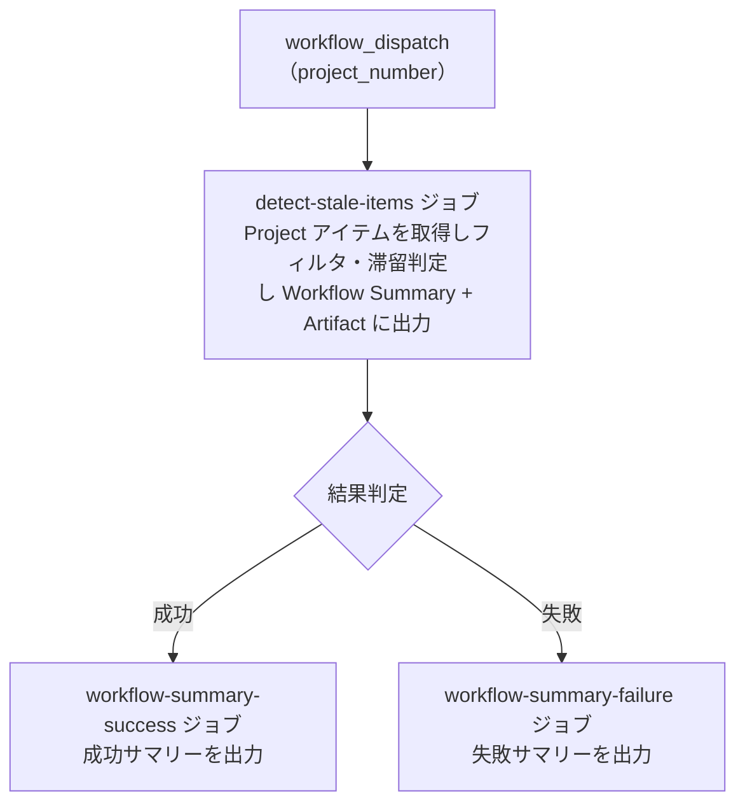

# ⑥ 🔍 滞留アイテム検知

<!-- START doctoc -->
<!-- END doctoc -->

指定した GitHub `Project` のアイテムを走査し、一定期間更新がない「滞留アイテム」を検知・レポートします。

## ✅ 前提

このワークフローを実行する前に、クイックスタートを完了してください。

- [クイックスタート（GUI）](../quickstart-gui)
- [クイックスタート（CLI）](../quickstart-cli)

## 📖 使い方

1. `Actions` タブを開く
2. `⑥ 滞留アイテム検知` を選択
3. `Run workflow` をクリック
4. パラメータを入力して実行

## ⚙️ パラメータ

| パラメータ | 説明 | 必須 | タイプ | 例 |
|------------|------|:----:|--------|-----|
| `project_number` | 対象 `Project` の Number | ✅ | `number` | `1` |

## 📊 滞留判定ルール

### ステータス別閾値

| ステータス | 閾値（日） | 説明 |
|-----------|:---------:|------|
| `Todo` | 14 | 着手予定のまま 2 週間以上経過 |
| `In Progress` | 7 | 作業中のまま 1 週間以上更新なし |
| `In Review` | 3 | レビュー中のまま 3 日以上更新なし |

### 判定基準

- **更新日時:** Issue / PR の `updatedAt`（コメント・コミット等のアクティビティを反映）
- **判定式:** `(現在日時 - コンテンツ更新日時) >= ステータス別閾値`

### 除外条件

| 条件 | 理由 |
|------|------|
| ステータスが `Done` | 完了済みのため検知不要 |
| ステータスが `Backlog` | 未着手のバックログは滞留とみなさない |
| `on-hold` ラベル | 意図的に保留されている |
| `blocked` ラベル | 外部要因で進行不可 |
| `DraftIssue` | プロジェクト内メモであり追跡対象外 |

> **Note:** 閾値・除外ラベルを変更する場合は、`scripts/detect-stale-items.sh` 内の定数を直接編集してください。

## 📋 出力

### Workflow Summary（Markdown テーブル）

ステータス別に滞留アイテムの一覧を Markdown テーブル形式で出力します。

出力項目:

| 項目 | 説明 |
|------|------|
| # | Issue / PR 番号（リンク付き） |
| タイトル | アイテムのタイトル |
| リポジトリ | 所属リポジトリ |
| アサイン | 担当者 |
| 最終更新 | 最終更新日 |
| 経過日数 | 最終更新からの経過日数 |

### Artifact（JSON）

`stale-items-report.json` が artifact としてダウンロード可能です（保持期間: 7 日）。

## 📊 処理フロー

## 🔗 関連ワークフロー

- [⑩ 統合プロジェクト分析](10-analyze-project) — サマリーレポート・工数集計とまとめて実行可能
