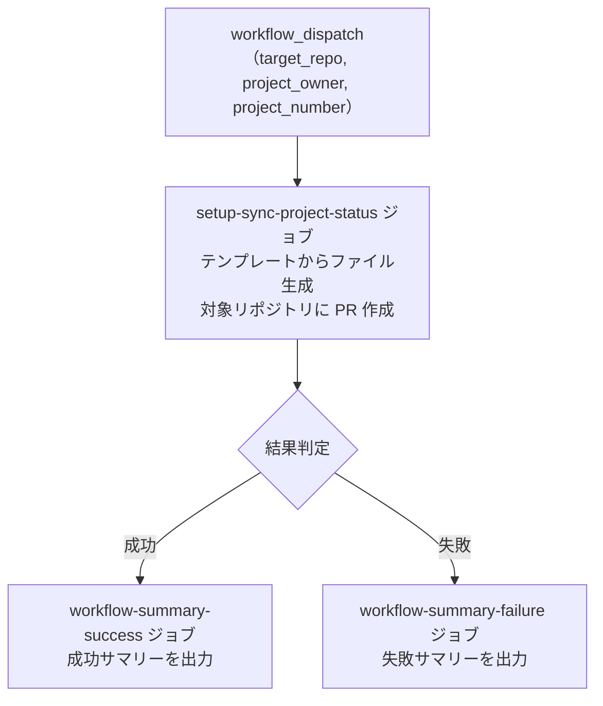
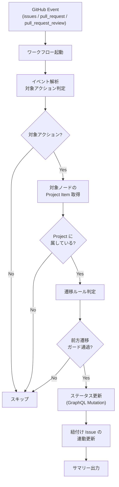

# ⑥ 🔄 ステータス自動同期セットアップ

<!-- START doctoc -->
<!-- END doctoc -->

対象リポジトリに、Issue/PR のライフサイクルイベントに連動してステータスを自動更新するワークフローを配置します。
2 層アーキテクチャ（セットアップワークフロー + 生成ワークフロー）を採用しています。

## ✅ 前提

このワークフローを実行する前に、クイックスタートを完了してください。

- [クイックスタート（GUI）](../quickstart-gui)
- [クイックスタート（CLI）](../quickstart-cli)

## 📖 使い方

1. `Actions` タブを開く
2. `⑥ ステータス自動同期セットアップ` を選択
3. `Run workflow` をクリック
4. パラメータを入力して実行
5. 対象リポジトリに PR が作成される
6. 対象リポジトリの Secrets に `PROJECT_PAT` を設定
7. PR をマージ

## ⚙️ パラメータ

| パラメータ | 説明 | 必須 | タイプ | 例 |
|------------|------|:----:|--------|-----|
| `target_repo` | 対象リポジトリ（owner/repo 形式） | ✅ | `string` | `myorg/myrepo` |
| `project_owner` | Project の所有者（ユーザー名 or 組織名） | ✅ | `string` | `myorg` |
| `project_number` | 対象 Project の番号 | ✅ | `number` | `1` |

## 📊 処理フロー



### 対象リポジトリでの動作



## 🔧 ワークフロー仕様

### ファイル

`.github/workflows/06-setup-sync-project-status.yml`

### トリガー

`workflow_dispatch`（手動実行）

### 権限

```yaml
permissions:
  contents: read
```

### 環境変数

| 環境変数 | ソース | 説明 |
|----------|--------|------|
| `GH_TOKEN` | `secrets.PROJECT_PAT` | GitHub PAT（Projects 操作権限 + 対象リポジトリへの書き込み権限） |
| `TARGET_REPO` | `inputs.target_repo` | 対象リポジトリ |
| `PROJECT_OWNER` | `inputs.project_owner` | Project の所有者 |
| `PROJECT_NUMBER` | `inputs.project_number` | 対象 Project の番号 |

### ジョブ構成

```
.github/workflows/06-setup-sync-project-status.yml
  ├── setup-sync-project-status ジョブ
  │   └── scripts/setup-sync-project-status.sh    # セットアップスクリプト
  ├── workflow-summary-failure ジョブ（失敗時）
  │   └── .github/actions/workflow-summary         # 失敗サマリー出力
  └── workflow-summary-success ジョブ（成功時）
      └── .github/actions/workflow-summary         # 成功サマリー出力
```

## 📦 生成されるファイル

セットアップワークフローは、対象リポジトリに以下のファイルを PR として配置します。

| ファイル | 説明 |
|---------|------|
| `.github/workflows/sync-project-status.yml` | イベント駆動ワークフロー |
| `scripts/sync-project-status.sh` | ステータス同期スクリプト |

## 🔄 ステータス遷移ルール

| イベント | 遷移先 |
|---------|--------|
| Issue opened | Backlog |
| Issue closed | Done |
| Issue reopened | Todo |
| PR opened | In Progress |
| PR review_requested / ready_for_review | In Review |
| PR converted_to_draft | In Progress |
| PR closed (merged/unmerged) | Done |
| Review changes_requested | In Progress |

### 前方遷移ガード

ステータスの後退を防ぐガードルールが適用されます。以下の 2 ケースのみ例外として許可されます。

- `In Review → In Progress`: レビューでの差し戻し（`changes_requested`）
- `Done → Todo`: Issue の再オープン（`reopened`）

### 紐付け Issue の連動更新

PR イベント時、紐付けられた Issue（`Closes #123` 等）のステータスも連動して更新されます。

| PR イベント | 紐付け Issue の遷移先 |
|------------|---------------------|
| PR opened | In Progress |
| PR closed (merged) | Done |
| Review changes_requested | In Progress |

## 🔑 対象リポジトリの前提条件

生成ワークフローが正しく動作するには、対象リポジトリで以下の設定が必要です。

| 設定項目 | 説明 |
|---------|------|
| `PROJECT_PAT` Secret | Projects 操作権限を持つ PAT |
| GitHub Actions 有効化 | ワークフロー実行の許可 |

> これらの手順はセットアップワークフローが作成する PR 本文に記載されます。

## 📜 関連スクリプト

- [setup-sync-project-status.sh](../scripts/setup-sync-project-status) — セットアップスクリプト

## 📚 参考資料

- [ステータス遷移ルール定義書](../investigation/status-sync-transition-rules.md)
- [ワークフロー入出力仕様書](../investigation/status-sync-workflow-spec.md)
