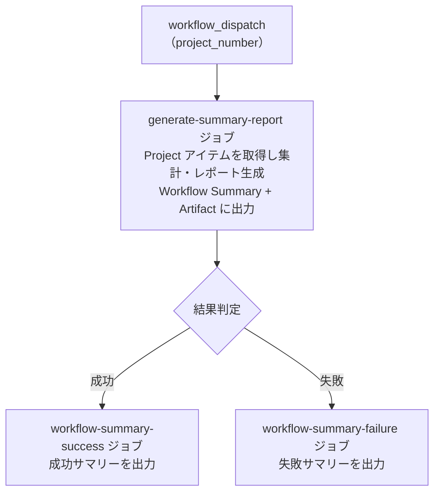

# ⑧ 📊 プロジェクトサマリーレポート

<!-- START doctoc -->
<!-- END doctoc -->

指定した GitHub `Project` のアイテムを走査し、ステータス別・担当者別・ラベル別の集計レポートを生成します。

## ✅ 前提

このワークフローを実行する前に、クイックスタートを完了してください。

- [クイックスタート（GUI）](../quickstart-gui)
- [クイックスタート（CLI）](../quickstart-cli)

## 📖 使い方

1. `Actions` タブを開く
2. `⑧ プロジェクトサマリーレポート` を選択
3. `Run workflow` をクリック
4. パラメータを入力して実行

## ⚙️ パラメータ

| パラメータ | 説明 | 必須 | タイプ | 例 |
|------------|------|:----:|--------|-----|
| `project_number` | 対象 `Project` の Number | ✅ | `number` | `1` |

## 📊 集計項目

### 必須項目

| # | 項目 | 説明 |
|---|------|------|
| 1 | 概要サマリー | 総アイテム数、Issue/PR 別件数 |
| 2 | ステータス別件数 | 各ステータスの件数と割合（Mermaid 円グラフ付き） |
| 3 | 担当者別件数 | 各担当者のアイテム数と In Progress / In Review 内訳 |
| 4 | ラベル別件数 | 各ラベルのアイテム数 |

### オプション項目（カスタムフィールド使用時）

| # | 項目 | 説明 |
|---|------|------|
| 5 | 工数サマリー | ステータス別の見積もり工数合計・実績工数合計 |
| 6 | 期日超過アイテム | 終了期日を過ぎた未完了アイテムの一覧 |

> **Note:** カスタムフィールドが設定されていないプロジェクトでは、オプション項目は自動的に非表示となります。

## 📋 出力

### Workflow Summary（Markdown + Mermaid）

ステータス別・担当者別・ラベル別の集計結果を Markdown テーブル形式で出力します。
ステータス別の分布は Mermaid 円グラフでも可視化されます。

出力項目:

| セクション | 内容 |
|-----------|------|
| ステータス別 | ステータス名、件数、割合（テーブル + Mermaid 円グラフ） |
| 担当者別 | 担当者名、件数、In Progress 数、In Review 数 |
| ラベル別 | ラベル名、件数 |
| 工数サマリー | ステータス別の見積もり・実績工数合計（オプション） |
| 期日超過アイテム | Issue/PR 番号、タイトル、ステータス、担当者、終了期日、超過日数（オプション） |

### Artifact（JSON）

`report-{number}-summary.json` が artifact としてダウンロード可能です（保持期間: 90 日）。

## 📊 処理フロー

## 🔗 関連ワークフロー

- [⑩ 統合プロジェクト分析](10-analyze-project) — 滞留検知・工数集計とまとめて実行可能
