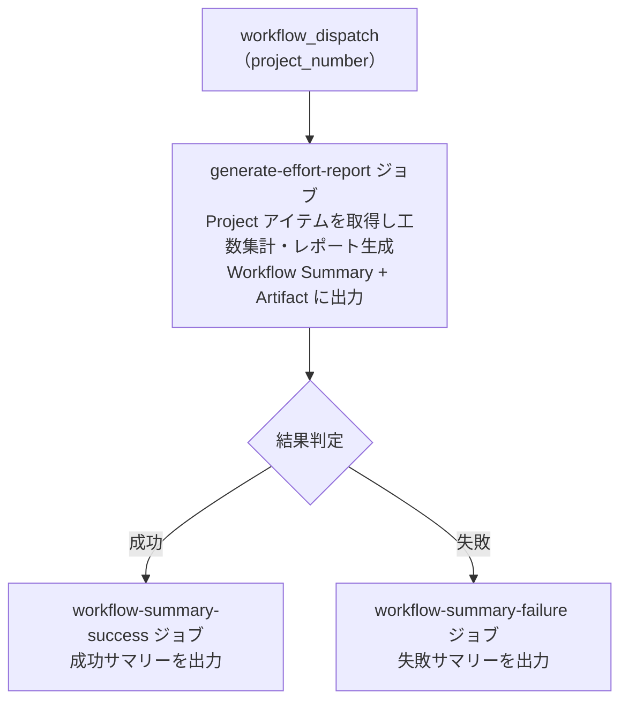

# ⑨ 📊 工数集計レポート

<!-- START doctoc -->
<!-- END doctoc -->

プロジェクトの見積もり工数・実績工数を多角的に集計・分析し、工数管理を支援するレポートを生成します。

## ✅ 前提

このワークフローを実行する前に、クイックスタートを完了してください。

- [クイックスタート（GUI）](../quickstart-gui)
- [クイックスタート（CLI）](../quickstart-cli)

## 📖 使い方

1. `Actions` タブを開く
2. `⑨ 工数集計レポート` を選択
3. `Run workflow` をクリック
4. パラメータを入力して実行

## ⚙️ パラメータ

| パラメータ | 説明 | 必須 | タイプ | 例 |
|------------|------|:----:|--------|-----|
| `project_number` | 対象 `Project` の Number | ✅ | `number` | `1` |

## 📊 集計項目

### 必須項目

| # | 項目 | 説明 |
|---|------|------|
| 1 | 全体サマリー | 総見積もり工数、総実績工数、全体乖離率、工数入力率 |
| 2 | 担当者別工数 | 担当者ごとの見積もり・実績工数、乖離率（Mermaid 円グラフ付き） |
| 3 | ステータス別工数 | ステータスごとの見積もり・実績工数、消化率 |
| 4 | 乖離アイテム | 見積もりと実績の乖離が大きいアイテム一覧（上位 10 件） |
| 5 | 工数未入力アイテム | 見積もり・実績ともに未入力のアイテム一覧 |

### オプション項目（日付フィールド使用時）

| # | 項目 | 説明 |
|---|------|------|
| 6 | リードタイム分析 | 計画・実績リードタイム、乖離日数、日あたり工数 |

> **Note:** 日付フィールド（開始予定/実績、終了予定/実績）が設定されていないプロジェクトでは、リードタイム分析は自動的に非表示となります。

## 📋 出力

### Workflow Summary（Markdown + Mermaid）

工数集計結果を Markdown テーブル形式で出力します。
担当者別の実績工数分布は Mermaid 円グラフでも可視化されます。

出力項目:

| セクション | 内容 |
|-----------|------|
| 全体サマリー | 総見積もり工数、総実績工数、全体乖離率、工数入力率 |
| 担当者別工数 | 担当者名、アイテム数、見積もり・実績工数、乖離率（テーブル + Mermaid 円グラフ） |
| ステータス別工数 | ステータス名、アイテム数、見積もり・実績工数、消化率 |
| 乖離アイテム | Issue/PR 番号、タイトル、担当者、見積もり・実績工数、乖離率 |
| リードタイム分析 | Issue/PR 番号、タイトル、計画・実績日数、乖離日数、日あたり工数（オプション） |
| 工数未入力アイテム | Issue/PR 番号、タイトル、ステータス、担当者 |

### Artifact（JSON）

`report-{number}-effort.json` が artifact としてダウンロード可能です（保持期間: 90 日）。

## 📊 処理フロー

## 🔗 関連ワークフロー

- [⑩ 統合プロジェクト分析](10-analyze-project) — 滞留検知・サマリーレポートとまとめて実行可能
