# ⑩ 📊 統合プロジェクト分析

<!-- START doctoc -->
<!-- END doctoc -->

ワークフロー⑥（滞留アイテム検知）、⑧（プロジェクトサマリーレポート）、⑨（工数集計レポート）を 1 つのワークフローにまとめ、1 回の実行で全分析を並列実行します。

## ✅ 前提

このワークフローを実行する前に、クイックスタートを完了してください。

- [クイックスタート（GUI）](../quickstart-gui)
- [クイックスタート（CLI）](../quickstart-cli)

## 📖 使い方

1. `Actions` タブを開く
2. `⑩ 統合プロジェクト分析` を選択
3. `Run workflow` をクリック
4. パラメータを入力して実行

## ⚙️ パラメータ

| パラメータ | 説明 | 必須 | タイプ | デフォルト | 例 |
|------------|------|:----:|--------|-----------|-----|
| `project_number` | 対象 `Project` の Number | ✅ | `number` | — | `1` |
| `report_types` | 実行する分析タイプ | — | `choice` | `all` | `stale` |

### `report_types` の選択肢

| 値 | 説明 |
|------|------|
| `all` | 全分析（滞留検知 + サマリー + 工数集計）を実行 |
| `stale` | 滞留アイテム検知のみ実行 |
| `summary` | プロジェクトサマリーレポートのみ実行 |
| `effort` | 工数集計レポートのみ実行 |

## 📊 含まれる分析

| # | 分析 | 相当ワークフロー | 説明 |
|---|------|-----------------|------|
| 1 | 滞留アイテム検知 | [⑥ 滞留アイテム検知](06-detect-stale-items) | 一定期間更新がないアイテムを検知 |
| 2 | プロジェクトサマリーレポート | [⑧ プロジェクトサマリーレポート](08-generate-summary-report) | ステータス別・担当者別・ラベル別集計 |
| 3 | 工数集計レポート | [⑨ 工数集計レポート](09-generate-effort-report) | 見積もり工数・実績工数の多角的集計 |

各分析の詳細（判定ルール、集計項目、出力形式など）は、個別ワークフローのドキュメントを参照してください。

## 📋 出力

### Workflow Summary

各分析ジョブがそれぞれの Workflow Summary を出力します。

### Artifact

| 分析 | ファイル名 | 保持期間 |
|------|-----------|---------|
| 滞留アイテム検知 | `stale-items-report.json` | 7 日 |
| プロジェクトサマリーレポート | `report-{number}-summary.json` | 90 日 |
| 工数集計レポート | `report-{number}-effort.json` | 90 日 |

## 📊 処理フロー

```mermaid
flowchart TD
    A["workflow_dispatch\n（project_number, report_types）"] --> B{"report_types 判定"}
    B -- "all or stale" --> C["detect-stale-items ジョブ\n滞留アイテム検知"]
    B -- "all or summary" --> D["generate-summary-report ジョブ\nサマリーレポート生成"]
    B -- "all or effort" --> E["generate-effort-report ジョブ\n工数集計レポート生成"]
    C & D & E --> F{"結果判定"}
    F -- "成功" --> G["workflow-summary-success ジョブ\n成功サマリーを出力"]
    F -- "失敗" --> H["workflow-summary-failure ジョブ\n失敗サマリーを出力"]
```

## 🔗 関連ワークフロー

各分析を個別に実行したい場合は、以下の個別ワークフローを使用してください。

- [⑥ 滞留アイテム検知](06-detect-stale-items)
- [⑧ プロジェクトサマリーレポート](08-generate-summary-report)
- [⑨ 工数集計レポート](09-generate-effort-report)
