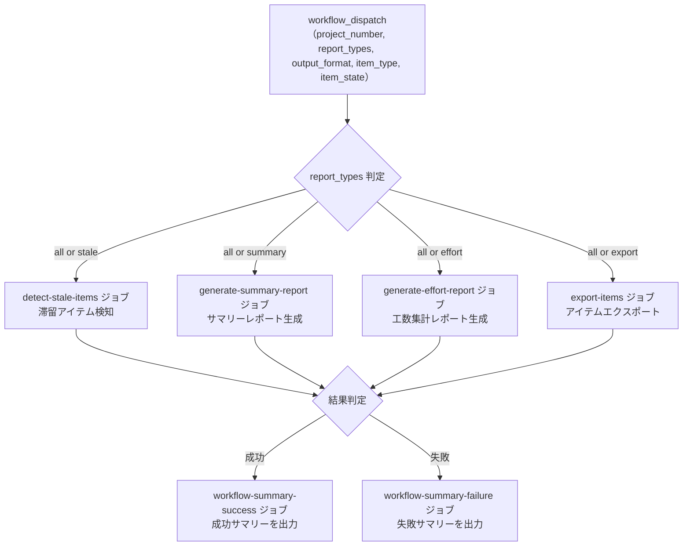

# ⑩ 📊 統合プロジェクト分析

<!-- START doctoc -->
<!-- END doctoc -->

指定した GitHub `Project` のアイテムを走査し、滞留アイテム検知・プロジェクトサマリーレポート・工数集計レポート・アイテムエクスポートを 1 回の実行でまとめて生成します。`report_types` パラメータで実行する分析を選択することも可能です。

## ✅ 前提

このワークフローを実行する前に、クイックスタートを完了してください。

- [クイックスタート（GUI）](../quickstart-gui)
- [クイックスタート（CLI）](../quickstart-cli)

## 📖 使い方

1. `Actions` タブを開く
2. `⑩ 統合プロジェクト分析` を選択
3. `Run workflow` をクリック
4. パラメータを入力して実行

## ⚙️ パラメータ

| パラメータ | 説明 | 必須 | タイプ | デフォルト | 例 |
|------------|------|:----:|--------|-----------|-----|
| `project_number` | 対象 `Project` の Number | ✅ | `number` | — | `1` |
| `report_types` | 実行する分析タイプ | — | `choice` | `all` | `stale` |
| `output_format` | 出力形式 | — | `choice` | `json` | `markdown` |
| `item_type` | 対象アイテムの種別 | — | `choice` | `all` | `issues` |
| `item_state` | 対象アイテムの状態 | — | `choice` | `all` | `open` |

### `report_types` の選択肢

| 値 | 説明 |
|------|------|
| `all` | 全機能（滞留検知 + サマリー + 工数集計 + エクスポート）を実行 |
| `stale` | 滞留アイテム検知のみ実行 |
| `summary` | プロジェクトサマリーレポートのみ実行 |
| `effort` | 工数集計レポートのみ実行 |
| `export` | アイテムエクスポートのみ実行 |

### `output_format` の選択肢

| 値 | 説明 |
|------|------|
| `json` | JSON 形式（構造化データ、デフォルト） |
| `markdown` | Markdown 形式（テーブル・チャート付きリッチレポート） |
| `csv` | CSV 形式（元データのフラット出力、外部ツール分析向け） |
| `tsv` | TSV 形式（元データのフラット出力、外部ツール分析向け） |

### `item_type` の選択肢

| 値 | 説明 |
|------|------|
| `all` | Issue と Pull Request の両方を対象 |
| `issues` | Issue のみを対象 |
| `prs` | Pull Request のみを対象 |

### `item_state` の選択肢

| 値 | 説明 |
|------|------|
| `all` | 全状態のアイテムを対象 |
| `open` | Open 状態のアイテムのみを対象 |
| `closed` | Closed / Merged 状態のアイテムのみを対象 |

---

## 🔍 滞留アイテム検知（stale）

一定期間更新がない「滞留アイテム」を検知・レポートします。

### 滞留判定ルール

#### ステータス別閾値

| ステータス | 閾値（日） | 説明 |
|-----------|:---------:|------|
| `Todo` | 14 | 着手予定のまま 2 週間以上経過 |
| `In Progress` | 7 | 作業中のまま 1 週間以上更新なし |
| `In Review` | 3 | レビュー中のまま 3 日以上更新なし |

#### 判定基準

- **更新日時:** Issue / PR の `updatedAt`（コメント・コミット等のアクティビティを反映）
- **判定式:** `(現在日時 - コンテンツ更新日時) >= ステータス別閾値`

#### 除外条件

| 条件 | 理由 |
|------|------|
| ステータスが `Done` | 完了済みのため検知不要 |
| ステータスが `Backlog` | 未着手のバックログは滞留とみなさない |
| `on-hold` ラベル | 意図的に保留されている |
| `blocked` ラベル | 外部要因で進行不可 |
| `DraftIssue` | プロジェクト内メモであり追跡対象外 |

> **Note:** 閾値・除外ラベルを変更する場合は、`scripts/detect-stale-items.sh` 内の定数を直接編集してください。

### 出力

#### Workflow Summary（Markdown テーブル）

ステータス別に滞留アイテムの一覧を Markdown テーブル形式で出力します。

出力項目:

| 項目 | 説明 |
|------|------|
| # | Issue / PR 番号（リンク付き） |
| タイトル | アイテムのタイトル |
| リポジトリ | 所属リポジトリ |
| アサイン | 担当者 |
| 最終更新 | 最終更新日 |
| 経過日数 | 最終更新からの経過日数 |

#### Artifact

`stale-items-report.{json|md|csv|tsv}` が artifact としてダウンロード可能です（保持期間: 7 日）。出力形式は `output_format` パラメータで選択できます。

---

## 📊 プロジェクトサマリーレポート（summary）

ステータス別・担当者別・ラベル別の集計レポートを生成します。

### 集計項目

#### 必須項目

| # | 項目 | 説明 |
|---|------|------|
| 1 | 概要サマリー | 総アイテム数、Issue/PR 別件数 |
| 2 | ステータス別件数 | 各ステータスの件数と割合（Mermaid 円グラフ付き） |
| 3 | 担当者別件数 | 各担当者のアイテム数と In Progress / In Review 内訳 |
| 4 | ラベル別件数 | 各ラベルのアイテム数 |

#### オプション項目（カスタムフィールド使用時）

| # | 項目 | 説明 |
|---|------|------|
| 5 | 工数サマリー | ステータス別の見積もり工数合計・実績工数合計 |
| 6 | 期日超過アイテム | 終了期日を過ぎた未完了アイテムの一覧 |

> **Note:** カスタムフィールドが設定されていないプロジェクトでは、オプション項目は自動的に非表示となります。

### 出力

#### Workflow Summary（Markdown + Mermaid）

ステータス別・担当者別・ラベル別の集計結果を Markdown テーブル形式で出力します。
ステータス別の分布は Mermaid 円グラフでも可視化されます。

出力項目:

| セクション | 内容 |
|-----------|------|
| ステータス別 | ステータス名、件数、割合（テーブル + Mermaid 円グラフ） |
| 担当者別 | 担当者名、件数、In Progress 数、In Review 数 |
| ラベル別 | ラベル名、件数 |
| 工数サマリー | ステータス別の見積もり・実績工数合計（オプション） |
| 期日超過アイテム | Issue/PR 番号、タイトル、ステータス、担当者、終了期日、超過日数（オプション） |

#### Artifact

`report-{number}-summary.{json|md|csv|tsv}` が artifact としてダウンロード可能です（保持期間: 90 日）。出力形式は `output_format` パラメータで選択できます。

---

## 📊 工数集計レポート（effort）

見積もり工数・実績工数を多角的に集計・分析し、工数管理を支援するレポートを生成します。

### 集計項目

#### 必須項目

| # | 項目 | 説明 |
|---|------|------|
| 1 | 全体サマリー | 総見積もり工数、総実績工数、全体乖離率、工数入力率 |
| 2 | 担当者別工数 | 担当者ごとの見積もり・実績工数、乖離率（Mermaid 円グラフ付き） |
| 3 | ステータス別工数 | ステータスごとの見積もり・実績工数、消化率 |
| 4 | 乖離アイテム | 見積もりと実績の乖離が大きいアイテム一覧（上位 10 件） |
| 5 | 工数未入力アイテム | 見積もり・実績ともに未入力のアイテム一覧 |

#### オプション項目（日付フィールド使用時）

| # | 項目 | 説明 |
|---|------|------|
| 6 | リードタイム分析 | 計画・実績リードタイム、乖離日数、日あたり工数 |

> **Note:** 日付フィールド（開始予定/実績、終了予定/実績）が設定されていないプロジェクトでは、リードタイム分析は自動的に非表示となります。

### 出力

#### Workflow Summary（Markdown + Mermaid）

工数集計結果を Markdown テーブル形式で出力します。
担当者別の実績工数分布は Mermaid 円グラフでも可視化されます。

出力項目:

| セクション | 内容 |
|-----------|------|
| 全体サマリー | 総見積もり工数、総実績工数、全体乖離率、工数入力率 |
| 担当者別工数 | 担当者名、アイテム数、見積もり・実績工数、乖離率（テーブル + Mermaid 円グラフ） |
| ステータス別工数 | ステータス名、アイテム数、見積もり・実績工数、消化率 |
| 乖離アイテム | Issue/PR 番号、タイトル、担当者、見積もり・実績工数、乖離率 |
| リードタイム分析 | Issue/PR 番号、タイトル、計画・実績日数、乖離日数、日あたり工数（オプション） |
| 工数未入力アイテム | Issue/PR 番号、タイトル、ステータス、担当者 |

#### Artifact

`report-{number}-effort.{json|md|csv|tsv}` が artifact としてダウンロード可能です（保持期間: 90 日）。出力形式は `output_format` パラメータで選択できます。

---

## 📤 アイテムエクスポート（export）

Project に紐づく Issue / Pull Request の一覧を取得し、エクスポートします。DraftIssue は出力対象外です。

> **Note:** この機能はワークフロー④（Project アイテム エクスポート）から統合されたものです。

### 出力項目

| 項目 | 説明 |
|------|------|
| type | 種別（`Issue` / `PullRequest`） |
| number | 番号 |
| title | タイトル |
| url | URL |
| state | 状態（OPEN / CLOSED / MERGED） |
| repository | リポジトリ名 |
| author | 作成者 |
| assignees | アサイン |
| labels | ラベル |
| created_at | 作成日時 |
| updated_at | 更新日時 |

### 出力

#### Artifact

`export-{number}-items.{json|md|csv|tsv}` が artifact としてダウンロード可能です（保持期間: 7 日）。出力形式は `output_format` パラメータで選択できます。

---

## 📊 処理フロー

